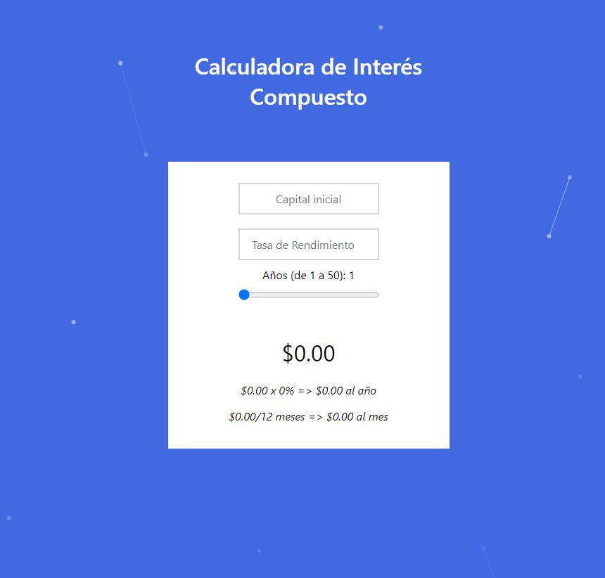

# Calculadora de Interés Compuesto

    El interés compuesto es un concepto de las finanzas que explica cómo puede multiplicarse una inversión dado cierta cantidad de tiempo. 
[Aquí un buen artículo que lo explica a fondo.](https://www.bbva.com/es/guia-de-finanzas-para-no-financieros-interes-compuesto/)

Interactua con la app aquí: [Demo](https://interest-compuesto-react.web.app/) (Desplegado usando Firebase Storage)

## Objetivos
* Echar un clavado al frontend usando ReactJS
* Revisar styling con vanilla CSS
* Aprender a desplegar un frontend en firebase
* Aprender cómo integrar otros componentes como react-particles-js en tu app

### ¿Cómo se usa?
1. Ingresas una capital inicial que es el dinero que pondrás por ejemplo en una cuenta de ahorro.
2. Selecciona una tasa de rendimiento con la que simularás tu inversión. **Los valores son del 0 al 1 (Ejemplo el 3.4% de tasa de interés lo pones como 0.034)**
3. Utilizando el slider selecciona por cuantos años dejas tu dinero sentado generando rendimiento.

El primer resultado verás la cantidad acumulada y más abajo se despliega tu rendimiento si dejaras tu cuenta otro año con la misma tasa.

Así podemos jugar con algunos números y empezar a visualizar cuanto dinero tendremos que ahorrar para poder vivir de nuestras inversiones.



## Instalación
```
git clone https://github.com/GaboGomez09/interes-compuesto-app.git
cd interes-compuesto-app
npm install
npm start
```

## TODO
- [ ] Arreglar CSS para que el formulario no se mueva cuando le haces scroll
- [ ] Refactor con filosofía de componentes _in mind_
- [ ] Automatizar CD con github actions
- [ ] Usar buenas prácticas de styling

_¡Siéntanse libres de hacer fork de este proyecto y mandar un pull request si ven una mejora!_

**Happy Coding!** :star: :alien: :star:
